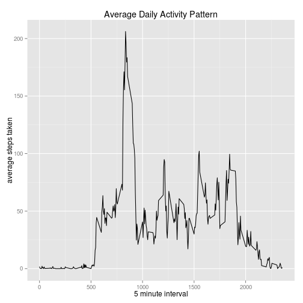

## Data Description

This assignment makes use of data from a personal activity monitoring device. This device collects data at 5 minute intervals through out the day. The data consists of two months of data from an anonymous individual collected during the months of October and November

The variables included in this dataset are:

steps: Number of steps taking in a 5-minute interval (missing values are coded as NA)

date: The date on which the measurement was taken in YYYY-MM-DD format

interval: Identifier for the 5-minute interval in which measurement was takenember, 2012 and include the number of steps taken in 5 minute intervals each day.

The dataset is stored in a comma-separated-value (CSV) file and there are a total of 17,568 observations in this dataset.
   
   
###Get Data


```r
setwd("/home/mikey/work/data/reproducible_research/RepData_PeerAssessment1/")
p1_data <- read.csv("activity.csv")
```

###Steps per day


```r
library(dplyr)
steps_per_date <- group_by(p1_data, date) 
steps_per_date <- summarize(steps_per_date, STEPS = sum(steps, na.rm = TRUE))
hist(steps_per_date$STEPS, main="Steps Taken per Day", xlab="Number of Steps per Day")
```

 

```r
mean_steps <- mean(steps_per_date$STEPS)
median_steps <- median(steps_per_date$STEPS)
mean(steps_per_date$STEPS)
```

```
## [1] 9354.23
```

```r
median(steps_per_date$STEPS)
```

```
## [1] 10395
```
Mean steps per day: 9354.2295082    
Median steps per day: 10395

###Time Series


```r
library(ggplot2)
p1_data_complete <- p1_data[complete.cases(p1_data), ]
steps_per_interval <- group_by(p1_data_complete, interval) 
summary_spi <- summarize(steps_per_interval, AV_STEPS = mean(steps, na.rm = TRUE))
max_av_steps <- max(summary_spi$AV_STEPS)
max_int_row <- filter(summary_spi, AV_STEPS == max_av_steps)
max_int <- max_int_row$interval
max_int
```

```
## [1] 835
```

```r
ggplot(data=summary_spi, aes(x=interval, y=AV_STEPS), na.omit()) +
     geom_line() +
     ggtitle("Average Daily Activity Pattern") +
     labs(x="5 minute interval",y="average steps taken")
```

 
   
  
Interval at which the maximimum average steps were taken: 835
  
###Imputing missing values
There are a number of days/intervals where there are missing values (coded as NA). The presence of missing days may introduce bias into some calculations or summaries of the data.  
  

```r
steps_na <- sum(is.na(p1_data$steps))
steps_na
```

```
## [1] 2304
```

```r
date_na <- sum(is.na(p1_data$date))
date_na
```

```
## [1] 0
```

```r
int_na <- sum(is.na(p1_data$interval))
int_na
```

```
## [1] 0
```
  
the steps variable is the only variable to contain NAs, with 2304 NAs.  
  
As a solution to this problem, we will fill each NA with the mean for that 5-minute interval.  


```r
#interval_means <- summarize(steps_per_interval, mean(steps))
#na_indices <- which(is.na(p1_data$steps))
p1_data_nona <- p1_data
p1_data_nona$steps[is.na(p1_data$steps)] = mean(p1_data_nona$steps, na.rm=TRUE)
steps_per_date <- group_by(p1_data_nona, date) 
steps_per_date <- summarize(steps_per_date, STEPS = sum(steps, na.rm = TRUE))
hist(steps_per_date$STEPS, main="Steps Taken per Day", xlab="Number of Steps per Day")
```

 

```r
mean_steps <- mean(steps_per_date$STEPS)
median_steps <- median(steps_per_date$STEPS)
```
Mean steps per day: 1.0766189 &times; 10<sup>4</sup>    
Median steps per day: 1.0766189 &times; 10<sup>4</sup>

As we can see, imputing values raised the number of steps per day.

###Differences in activity patterns between weekdays and weekends

We will create a new factor variable in the dataset with two levels – “weekday” and “weekend” indicating whether a given date is a weekday or weekend day.  


```r
p1_data_complete <- p1_data[complete.cases(p1_data), ]
p1_data_days <- mutate(p1_data_complete, weekend =  chron::is.weekend(as.Date(p1_data_complete$date)))
p1_data_days$weekend <- as.factor(ifelse(p1_data_days$weekend == TRUE, "weekend", "weekday"))

steps_per_interval <- group_by(p1_data_days, interval, weekend) 
summary_spi <- summarize(steps_per_interval, AV_STEPS = mean(steps, na.rm = TRUE))

# panel plot
library(lattice)
xyplot(AV_STEPS~interval | weekend, data=summary_spi, pch=19,
                main="Average Daily Activity Pattern - weekdays vs weekends", 
      xlab="5 minute interval",  ylab="average steps taken",layout=c(1,2),type="l")
```

 
